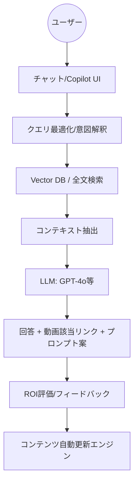

# 技術仕様案 (Architecture)

## 1. コンテンツ処理パイプライン
収集された学習コンテンツ（動画・ドキュメント）をAIが理解可能な形式に変換する非同期処理基盤です。

1.  **Ingestion**: 動画ファイルのアップロード。
2.  **Transcription**: Speech-to-Text (Whisper等) による全文書き起こし。
3.  **Atomization**: LLMによるセマンティックな分割（3-5分単位）とメタデータ付与。
4.  **Embedding**: Azure OpenAI / OpenAI の Embedding モデルによるベクトル化。
5.  **Indexing**: Vector DB への格納。

## 2. RAG検索システム構成図

## 3. 推奨技術スタック案

| レイヤー | 推奨コンポーネント | 選定理由 |
| :--- | :--- | :--- |
| **LLM (Reasoning)** | GPT-4o / Claude 3.5 Sonnet | 高い推論能力と要約精度 |
| **Vector DB** | Pinecone / Weaviate (Managed) | スケーラビリティと検索性能の両立 |
| **Infrastructure** | AWS (Fargate / S3 / Lambda) | セキュリティと既存環境との親和性 |
| **Frontend** | React + Next.js | 高速なUIレスポンスと拡張性 |
| **Speech-to-Text** | OpenAI Whisper (v3) | 公序良俗・ドメイン用語への対応力 |

## 4. セキュリティとプライバシー
*   **データ分離**: {Client}様専用の隔離環境内での推論とデータ保持。
*   **権限管理**: 職級に応じたアクセス制御（RBAC）の実装。
*   **学習拒否**: 入力データをモデルの再学習に使用しない設定の徹底。
